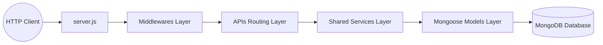

```markdown
# Suntech Assignments - Week 3: Modular Blog Application Backend

Welcome to the documentation for the Week 3 core assignment. This week shifted focus from local simulations entirely into enterprise-grade **Backend Server Architecture**. We constructed a fully scalable, secure, and modular REST API backend for a **Blog Application** using Node.js, Express, and Mongoose (MongoDB).

---

## 📂 Backend Project Folder Structure

The backend follows a strict **Layered Architecture Pattern** to enforce separation of concerns, ensuring that database logic, routing mechanisms, and business validations never conflict:

```text
Blog_app_backend/
├── APIs/               # Routing Layer (Defines HTTP endpoints & interfaces)
│   ├── user.api.js     # User registration, login, and profile endpoints
│   ├── author.api.js   # Author-specific operational routes
│   └── blog.api.js     # Blog CRUD operations & comment streams
├── middlewares/        # Interceptor Layer (Request preprocessing & safety checks)
│   ├── bodyParser.js   # Custom/configured incoming payload parsers
│   └── errorHandler.js # Centralized catch-all global error interceptor
├── models/             # Data Layer (Database Schemas & Data Constraints)
│   ├── user.model.js   # MongoDB User schema structure
│   ├── author.model.js # MongoDB Author schema structure
│   └── blog.model.js   # MongoDB Blog post & nested comments schema
├── services/           # Business Logic Layer (Shared routines & helpers)
│   └── auth.service.js # Reusable validation, hashing, and token generation
├── .env                # Controlled Environment Configurations (Hidden locally)
├── .gitignore          # Prevents pushing node_modules/ and secrets to GitHub
├── package.json        # Project metadata, ES Module declarations, & dependencies
├── req.http            # Local HTTP client file for rapid endpoint testing
└── server.js           # Main Entry Point (Bootstraps Express & DB connections)

```

---

## 🛠️ Architectural Layers & Workflow Design



### 1. The Bootstrapper (`server.js`)

Acts as the central gateway of the application. It loads environment-specific parameters via `dotenv`, initializes the Express app, establishes a persistent connection to MongoDB using Mongoose, and binds global middleware utilities.

### 2. Schemas & Models Layer (`models/`)

Defines the strict structural integrity of database documents using Mongoose.

* **User & Author Collections:** Enforces mandatory fields, strict data types, unique constraints (e.g., uniqueness on email properties), and default values.
* **Blog Post Matrix:** Configured to cleanly host arrays of nested comment schemas or object relationships, establishing structural connectivity between authors and posts.

### 3. Reusable Shared Services Layer (`services/`)

Built explicitly around the **DRY (Don't Repeat Yourself)** engineering principle.

* **Role-Based Authentication Engine:** Instead of duplicating sensitive code like password validation across separate files for Users, Authors, and Admins, a centralized service processes registration, token handshakes, and credentials universally based on dynamic incoming roles.

### 4. Custom Middlewares (`middlewares/`)

Maintains runtime health and filters incoming payloads before they hit business routing:

* **Body Parsers:** Standardizes inbound traffic via `express.json()` and url-encoded processors.
* **Global Error Handler:** A unified wrapper middleware. Whenever an exception occurs across any route, it bypasses standard server crashes, logs the anomaly, and returns an elegant, human-readable JSON error payload back to the client.

### 5. API Routing Layer (`APIs/`)

Exposes structured RESTful resource paths using specific HTTP verbs to govern data manipulation cleanly:

* `GET`: Retrieves data indexes or specific singular resource IDs.
* `POST`: Creates new database entries securely.
* `PUT`/`PATCH`: Modifies historical properties dynamically.
* `DELETE`: Safely expunges targeted assets from the ecosystem.

---

## 🚀 Setup & Initialization Guide

Follow these steps to initialize and spin up the development environment from scratch:

### 1. Clone & Core Configuration

Initialize your environment tracker files and prevent pushing vulnerabilities:

```bash
git init
touch .env .gitignore

```

Add standard configurations inside your `.gitignore`:

```text
node_modules/
.env

```

### 2. Dependency Infrastructure

Generate your node environment tracking map and download core ecosystem frameworks:

```bash
npm init -y
npm install express mongoose dotenv

```

> ⚠️ **Critical Requirement:** Open the `package.json` file and declare explicit support for modern ES Modules alongside the primary script target:
> ```json
> "type": "module",
> "main": "server.js"
> 
> ```
> 
> 

### 3. Running the Server

To execute and run the backend system, call the central entrypoint via node:

```bash
node server.js

```

### 4. API Testing Protocol

You can test each API endpoint locally without launching an interface tool by utilizing the `req.http` file integrated within the directory via any popular HTTP extension client.

```http
### Register User Example
POST http://localhost:5000/api/users/register
Content-Type: application/json

{
  "name": "Sidhvi",
  "email": "sidhvi@example.com",
  "password": "SecurePassword123"
}

```

---

```

```
